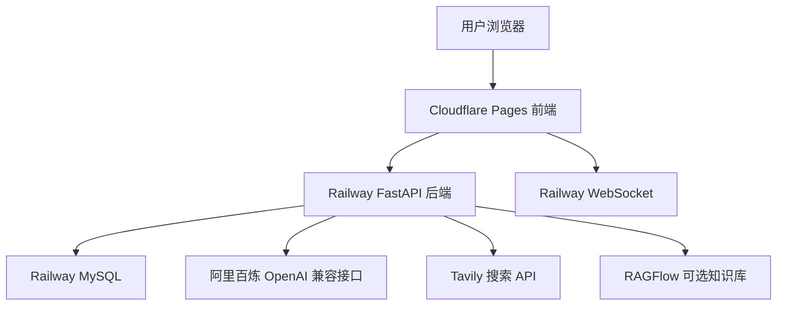

# DeepSearch Agents 部署全流程复盘

本文记录这次把 `deepsearch-agents` 从本地 PowerShell 项目部署成网页应用的完整流程。

最终架构：

```text
用户浏览器
  -> Cloudflare Pages 前端
  -> Railway FastAPI 后端
  -> Railway MySQL 数据库
  -> 百炼 / Tavily / RAGFlow 等外部服务
```

最终访问地址：

- 前端页面: <https://deepsearch-agents-web.pages.dev>
- 后端健康检查: <https://deepsearch-agents-web-production.up.railway.app/api/health>

## 1. 本地项目准备

项目位置：

```powershell
E:\Agent学习\chapter7\deepsearch-agents
```

本地需要的基础环境：

- Python 3.12
- uv
- Node.js
- pnpm
- Docker Desktop
- GitHub CLI
- Railway CLI
- Cloudflare Wrangler

本地后端依赖检查：

```powershell
cd E:\Agent学习\chapter7\deepsearch-agents
uv sync --frozen
```

本地前端依赖和构建检查：

```powershell
cd E:\Agent学习\chapter7\deepsearch-agents\frontend
pnpm install
pnpm build
```

本地 Docker 后端镜像验证：

```powershell
cd E:\Agent学习\chapter7\deepsearch-agents
docker build -f Dockerfile.backend -t deepsearch-backend:railway-check .
```

## 2. 为部署补充的项目配置

这次为部署补了几个关键文件和配置。

### `Dockerfile.backend`

用途：让 Railway 可以用 Docker 部署 FastAPI 后端。

核心逻辑：

```dockerfile
FROM python:3.12-slim

WORKDIR /app

ENV PYTHONUNBUFFERED=1
ENV PORT=8000

RUN pip install --no-cache-dir uv

COPY pyproject.toml uv.lock ./
RUN uv sync --frozen

COPY app ./app

EXPOSE 8000

CMD ["sh", "-c", "uv run uvicorn app.api.server:app --host 0.0.0.0 --port ${PORT}"]
```

关键点：

- Railway 会注入 `$PORT`
- 后端必须监听 `0.0.0.0`
- 不能只监听 `127.0.0.1`

### `railway.json`

用途：告诉 Railway 使用 `Dockerfile.backend`，并用 `/api/health` 做健康检查。

```json
{
  "$schema": "https://railway.com/railway.schema.json",
  "build": {
    "builder": "DOCKERFILE",
    "dockerfilePath": "Dockerfile.backend"
  },
  "deploy": {
    "healthcheckPath": "/api/health",
    "healthcheckTimeout": 120,
    "restartPolicyType": "ON_FAILURE",
    "restartPolicyMaxRetries": 3
  }
}
```

### 后端健康检查接口

在 `app/api/server.py` 中新增：

```python
@app.get("/api/health")
async def health_check():
    """Lightweight health check for hosted deployment platforms."""
    return {"status": "ok"}
```

### `.dockerignore`

用途：避免 Docker 构建时上传无关内容，例如本地虚拟环境、日志、前端依赖、文档等。

### `frontend/.env.production.example`

用途：记录前端线上需要配置的变量。

```env
VITE_API_BASE_URL=https://your-backend.example.com
VITE_WS_BASE_URL=wss://your-backend.example.com
```

## 3. 推送到自己的 GitHub 仓库

原项目 remote 指向作者仓库：

```text
https://github.com/didilili/deepsearch-agents.git
```

我们创建了自己的私有仓库：

```text
https://github.com/291536210mdy-svg/deepsearch-agents-web
```

修正 remote：

```powershell
git remote rename origin upstream
git remote add origin https://github.com/291536210mdy-svg/deepsearch-agents-web.git
```

提交部署配置：

```powershell
git add .gitignore app/api/server.py .dockerignore DEPLOYMENT.md Dockerfile.backend frontend/.env.production.example railway.json
git commit -m "Prepare web deployment"
```

推送时遇到过两个问题。

问题 1：remote 还是占位符。

```text
https://github.com/你的GitHub用户名/deepsearch-agents-web.git
```

修复：

```powershell
git remote set-url origin https://github.com/291536210mdy-svg/deepsearch-agents-web.git
```

问题 2：Git 走了失效代理。

```text
http.proxy=http://127.0.0.1:8800
https.proxy=http://127.0.0.1:8800
```

临时绕过代理推送：

```powershell
git -c http.proxy= -c https.proxy= push -u origin main
```

问题 3：本地仓库是 shallow clone，第一次 push 报对象缺失。

修复：

```powershell
git -c http.proxy= -c https.proxy= fetch --unshallow upstream
git -c http.proxy= -c https.proxy= push -u origin main
```

## 4. Railway 部署 FastAPI 后端

Railway 项目：

```text
harmonious-friendship
```

Railway 后端服务：

```text
deepsearch-agents-web
```

后端公网地址：

```text
https://deepsearch-agents-web-production.up.railway.app
```

健康检查：

```text
https://deepsearch-agents-web-production.up.railway.app/api/health
```

部署步骤：

1. 打开 Railway Dashboard
2. New Project
3. Deploy from GitHub repo
4. 选择 `291536210mdy-svg/deepsearch-agents-web`
5. Root Directory 保持仓库根目录
6. Railway 读取 `railway.json`
7. 使用 `Dockerfile.backend` 部署 FastAPI

## 5. 修复 Railway Healthcheck Failure

第一次 Railway 部署失败，页面显示：

```text
Deployment failed during network process
Network > Healthcheck
Healthcheck failure
```

本地复现后发现原因：

```text
tavily.errors.MissingAPIKeyError:
No API key provided.
Please provide the api_key attribute or set the TAVILY_API_KEY environment variable.
```

原因不是代码构建失败，而是后端启动时会导入主 Agent，主 Agent 又会初始化 Tavily、模型、RAGFlow 等配置。

所以 `/api/health` 虽然很轻，但服务启动阶段已经需要关键环境变量。

Railway 后端至少需要这些变量：

```env
OPENAI_BASE_URL=https://dashscope.aliyuncs.com/compatible-mode/v1
OPENAI_API_KEY=不要写在文档里
LLM_QWEN_MAX=qwen3-vl-30b-a3b-thinking
TAVILY_API_KEY=不要写在文档里
```

写入 Railway 变量后重新部署：

```powershell
railway service redeploy --service 47509b28-ff77-4efb-be9e-cd7b71e58cfd --yes
```

验证：

```powershell
Invoke-WebRequest -UseBasicParsing https://deepsearch-agents-web-production.up.railway.app/api/health
```

成功结果：

```json
{"status":"ok"}
```

## 6. 模型切换

最终模型配置为：

```env
LLM_QWEN_MAX=qwen3-vl-30b-a3b-thinking
```

本地 `.env` 和 Railway 后端变量都同步更新。

注意：

- API Key 不要提交到 GitHub
- API Key 不要写进 Markdown 文档
- 真实商业化前建议重新生成新的生产 Key

## 7. Railway 新建 MySQL

在同一个 Railway 项目里创建 MySQL：

```powershell
railway add --database mysql --json
```

创建出的 MySQL 服务：

```text
MySQL
```

服务 ID：

```text
22cc750c-0430-4258-a2e2-d86ad8c8f7f3
```

MySQL 使用 Railway volume 持久化：

```text
mysql-volume -> /var/lib/mysql
```

## 8. 导出本地 MySQL 数据

本地 MySQL 容器：

```text
deepsearch-mysql
```

本地导出的 SQL 文件：

```text
E:\Agent学习\chapter7\railway-deploy\deepsearch_mysql_export.sql
```

导出内容包括三张表：

- `drugs`
- `inventory`
- `sales_records`

## 9. 导入数据到 Railway MySQL

Railway MySQL 提供两类连接：

- 内网连接：给 Railway 后端服务使用
- TCP Proxy 公网连接：用于本地导入、维护和调试

导入方式：

```powershell
docker cp E:\Agent学习\chapter7\railway-deploy\deepsearch_mysql_export.sql deepsearch-mysql:/tmp/railway_import.sql
```

然后使用 Railway MySQL 的 TCP Proxy 连接导入。

导入后验证：

```sql
SHOW TABLES;

SELECT 'drugs' AS table_name, COUNT(*) AS row_count FROM drugs
UNION ALL SELECT 'inventory', COUNT(*) FROM inventory
UNION ALL SELECT 'sales_records', COUNT(*) FROM sales_records;
```

验证结果：

```text
drugs          50
inventory      150
sales_records  100
```

## 10. 后端接入 Railway MySQL

后端服务需要这些数据库变量：

```env
MYSQL_HOST=${{MySQL.MYSQLHOST}}
MYSQL_PORT=${{MySQL.MYSQLPORT}}
MYSQL_USER=${{MySQL.MYSQLUSER}}
MYSQL_PASSWORD=${{MySQL.MYSQLPASSWORD}}
MYSQL_DATABASE=${{MySQL.MYSQLDATABASE}}
MYSQL_CHARSET=utf8mb4
MYSQL_COLLATION=utf8mb4_unicode_ci
MYSQL_SQL_MODE=TRADITIONAL
```

这些变量配置在 Railway 后端服务 `deepsearch-agents-web` 上。

配置后重新部署后端：

```powershell
railway service redeploy --service 47509b28-ff77-4efb-be9e-cd7b71e58cfd --yes
```

再次验证：

```text
https://deepsearch-agents-web-production.up.railway.app/api/health
```

返回：

```json
{"status":"ok"}
```

## 11. Cloudflare Pages 部署前端

最终没有使用 Vercel，而是把前端部署到了 Cloudflare Pages。

Cloudflare Pages 项目名：

```text
deepsearch-agents-web
```

前端地址：

```text
https://deepsearch-agents-web.pages.dev
```

登录 Cloudflare Wrangler：

```powershell
cd E:\Agent学习\chapter7\deepsearch-agents\frontend
pnpm dlx wrangler login
```

创建 Cloudflare Pages 项目：

```powershell
pnpm dlx wrangler pages project create deepsearch-agents-web --production-branch main
```

用线上 Railway 后端地址构建前端：

```powershell
cd E:\Agent学习\chapter7\deepsearch-agents\frontend

$env:VITE_API_BASE_URL='https://deepsearch-agents-web-production.up.railway.app'
$env:VITE_WS_BASE_URL='wss://deepsearch-agents-web-production.up.railway.app'

pnpm build
```

部署到 Cloudflare Pages：

```powershell
pnpm dlx wrangler pages deploy dist --project-name=deepsearch-agents-web --branch=main
```

部署成功后访问：

```text
https://deepsearch-agents-web.pages.dev
```

## 12. 前端为什么要配置两个 URL

前端需要 HTTP API 地址：

```env
VITE_API_BASE_URL=https://deepsearch-agents-web-production.up.railway.app
```

用于：

- `/api/task`
- `/api/upload`
- `/api/files`
- `/api/download`

前端还需要 WebSocket 地址：

```env
VITE_WS_BASE_URL=wss://deepsearch-agents-web-production.up.railway.app
```

用于：

- `/ws/{thread_id}`
- 实时接收 Agent 执行事件
- 展示工具调用、子智能体调用、最终结果

本地开发时是：

```env
VITE_API_BASE_URL=http://127.0.0.1:8010
VITE_WS_BASE_URL=ws://127.0.0.1:8010
```

线上部署时必须改成：

```env
VITE_API_BASE_URL=https://...
VITE_WS_BASE_URL=wss://...
```

## 13. 最终部署结构



## 14. 测试问题

### 测试数据库链路

```text
请使用数据库查询工具，查询库存大于 100 的药品，按库存量从高到低列出药品名称、批次号、仓库位置、库存数量和过期日期。
```

这个问题可以验证：

```text
Cloudflare 前端 -> Railway 后端 -> Railway MySQL
```

### 测试联网搜索链路

```text
请使用网络搜索工具，调研 2026 年 AI Agent 在企业知识管理中的应用趋势，列出 5 个趋势，并附来源链接。
```

这个问题可以验证：

```text
Cloudflare 前端 -> Railway 后端 -> Tavily
```

### 测试报告生成能力

```text
请先查询数据库中库存风险较高的药品，再生成一份 Markdown 分析报告，内容包括库存概览、风险药品、建议动作，并保存到当前工作目录。
```

这个问题可以验证：

```text
数据库查询 -> 主 Agent 汇总 -> Markdown 文件生成 -> 前端下载
```

## 15. 常见问题排查

### Railway Healthcheck Failure

优先检查：

```env
OPENAI_BASE_URL
OPENAI_API_KEY
LLM_QWEN_MAX
TAVILY_API_KEY
```

如果缺 `TAVILY_API_KEY`，容器会直接退出。

### 前端能打开，但发问题失败

检查前端构建时是否用了线上后端地址：

```powershell
rg "deepsearch-agents-web-production.up.railway.app|localhost|127.0.0.1" dist
```

如果 `dist` 里还有 `localhost` 或 `127.0.0.1`，说明构建时环境变量没生效。

### WebSocket 连接失败

检查：

```env
VITE_WS_BASE_URL=wss://deepsearch-agents-web-production.up.railway.app
```

不要用：

```env
ws://...
```

HTTPS 页面必须连 `wss://`。

### 数据库查询失败

检查 Railway 后端服务变量：

```env
MYSQL_HOST=${{MySQL.MYSQLHOST}}
MYSQL_PORT=${{MySQL.MYSQLPORT}}
MYSQL_USER=${{MySQL.MYSQLUSER}}
MYSQL_PASSWORD=${{MySQL.MYSQLPASSWORD}}
MYSQL_DATABASE=${{MySQL.MYSQLDATABASE}}
```

然后重新部署后端。

## 16. 后续维护命令

### 重新部署 Railway 后端

```powershell
cd E:\Agent学习\chapter7\deepsearch-agents
railway service redeploy --service 47509b28-ff77-4efb-be9e-cd7b71e58cfd --yes
```

### 重新部署 Cloudflare 前端

```powershell
cd E:\Agent学习\chapter7\deepsearch-agents\frontend

$env:VITE_API_BASE_URL='https://deepsearch-agents-web-production.up.railway.app'
$env:VITE_WS_BASE_URL='wss://deepsearch-agents-web-production.up.railway.app'

pnpm build
pnpm dlx wrangler pages deploy dist --project-name=deepsearch-agents-web --branch=main
```

### 检查后端健康状态

```powershell
Invoke-WebRequest -UseBasicParsing https://deepsearch-agents-web-production.up.railway.app/api/health
```

### 检查 Cloudflare 前端

```powershell
Invoke-WebRequest -UseBasicParsing https://deepsearch-agents-web.pages.dev
```

## 17. 安全注意事项

不要把这些内容提交到 GitHub：

- `.env`
- `OPENAI_API_KEY`
- `TAVILY_API_KEY`
- `RAGFLOW_API_KEY`
- Railway MySQL 密码
- Railway MySQL 公网连接字符串

建议：

1. 本地 `.env` 只留在本机。
2. Railway 变量只在 Railway Dashboard 或 CLI 中配置。
3. Cloudflare 前端只能放公开可见变量。
4. 不要把任何服务端密钥放进 `VITE_` 开头的变量。
5. 真实商业化前重新生成生产 API Key。
6. 定期备份 Railway MySQL。
7. 如果出现真实用户数据，要补认证、权限、日志脱敏和限流。

## 18. 当前结论

这次部署已经完成了一个可被非技术用户访问的网页版本：

```text
https://deepsearch-agents-web.pages.dev
```

用户不需要再打开 PowerShell，也不需要本地安装 Python、uv、Docker 或 Node。

现在项目的运行责任拆分为：

- Cloudflare Pages：负责前端网页访问
- Railway FastAPI：负责 Agent 执行、WebSocket、文件上传下载
- Railway MySQL：负责结构化业务数据
- 百炼 / Tavily / RAGFlow：负责模型、搜索和知识库能力

