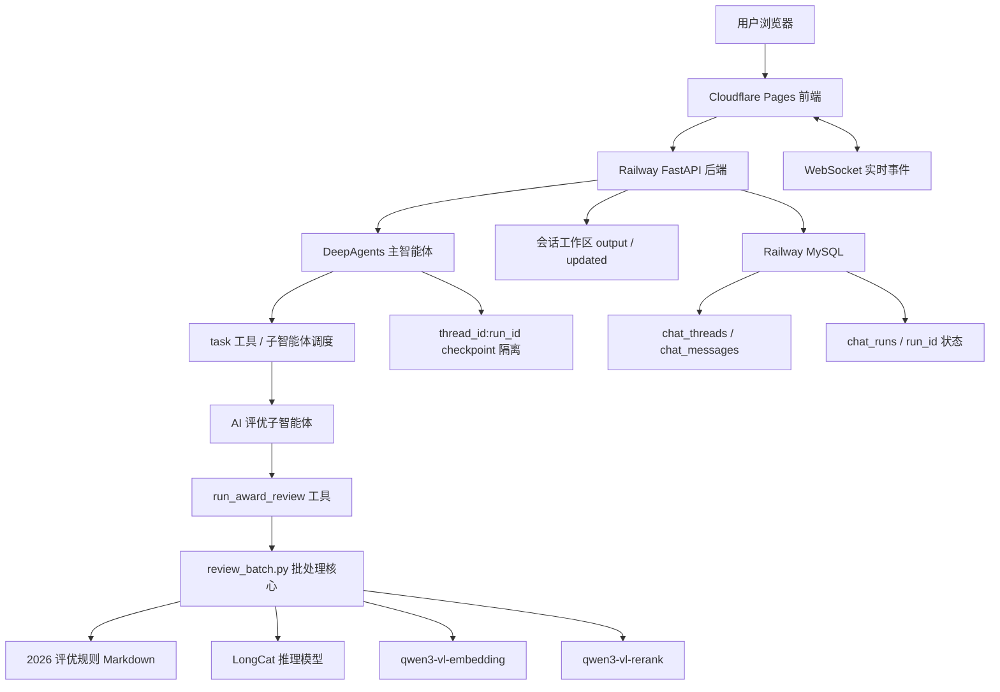
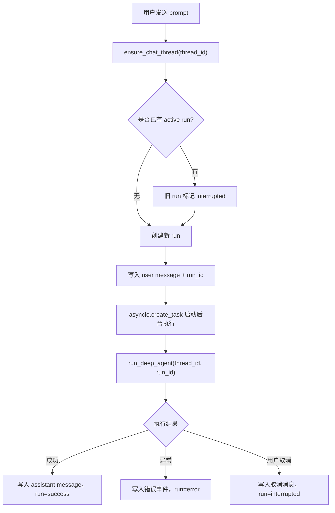
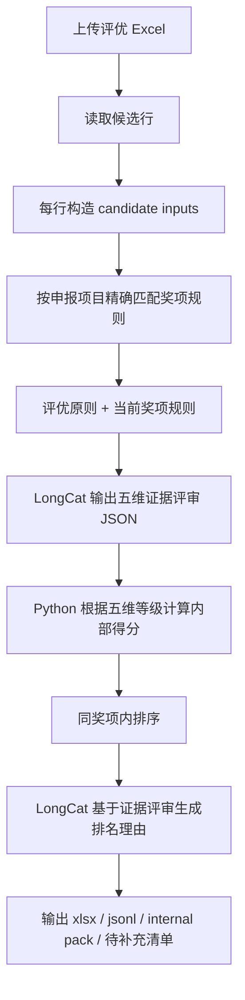

# DeepSearch Agents 智能体平台技术路线与部署路径

更新时间：2026-07-08

本文档用于交接和复盘当前智能体平台的完整技术路线、关键代码位置、评优业务流程、线上部署路径和后续维护方式。

## 1. 当前线上入口

| 层级 | 当前地址 / 位置 | 说明 |
|---|---|---|
| 用户访问入口 | <https://deepsearch-agents-web.pages.dev/> | Cloudflare Pages 托管的前端页面 |
| 后端服务 | <https://deepsearch-agents-web-production.up.railway.app> | Railway 托管的 FastAPI 后端 |
| 健康检查 | <https://deepsearch-agents-web-production.up.railway.app/api/health> | 返回 `{"status":"ok"}` 表示后端在线 |
| GitHub 仓库 | `291536210mdy-svg/deepsearch-agents-web` | Railway 从该仓库自动构建后端 |
| 本地源码 | `E:\Agent学习\chapter7\deepsearch-agents` | 当前本机项目目录 |

前端页面本身不执行智能体逻辑。用户在 Cloudflare 页面发起任务后，请求会转发到 Railway 后端，由 FastAPI 启动 DeepAgents 任务并通过 WebSocket 推送过程和结果。

## 2. 总体技术路线



核心路线是：

1. 前端负责上传文件、发送任务、展示流式过程和下载产物。
2. FastAPI 后端负责 HTTP API、WebSocket、会话目录、文件上传下载、thread/run 生命周期和后台任务状态。
3. DeepAgents 主智能体负责理解用户请求，并根据子智能体描述决定是否把任务委派给评优、数据库、搜索、文件等助手。
4. 评优子智能体只暴露一个核心工具：`run_award_review`。
5. `run_award_review` 调用 `review_batch.py`，完成 Excel 读取、规则匹配、模型评审、Python 排名、排名理由生成和结果文件输出。
6. 产物写入当前会话的 `output/session_xxx/award_review` 目录，再由前端通过文件接口下载。
7. 每次用户发送 prompt 都会创建一个独立 `run_id`，取消、完成、失败和上下文恢复都按 run 管理，避免半截任务继续污染下一次对话。

## 3. 前端技术路线

前端目录：

`E:\Agent学习\chapter7\deepsearch-agents\frontend`

关键文件：

| 文件 | 作用 |
|---|---|
| `frontend/src/lib/config.ts` | 读取 `VITE_API_BASE_URL` 和 `VITE_WS_BASE_URL`，决定连接哪个后端 |
| `frontend/src` | React/Vite 前端源码 |
| `frontend/dist` | 构建后的静态文件 |
| `frontend/.env.production.example` | 生产环境变量示例 |
| `frontend/vite.config.ts` | Vite 构建配置 |

生产环境应该配置：

```env
VITE_API_BASE_URL=https://deepsearch-agents-web-production.up.railway.app
VITE_WS_BASE_URL=wss://deepsearch-agents-web-production.up.railway.app
```

如果 `VITE_WS_BASE_URL` 没有显式配置，前端会根据 `VITE_API_BASE_URL` 自动把 `https://` 推导为 `wss://`。

## 4. 后端技术路线

后端入口：

`E:\Agent学习\chapter7\deepsearch-agents\app\api\server.py`

关键 API：

| 接口 | 作用 |
|---|---|
| `GET /api/health` | Railway 健康检查 |
| `POST /api/task` | 在指定 thread 下创建一个新的 `run_id`，并启动一次 DeepAgents 后台任务 |
| `GET /api/chats/{thread_id}/runs` | 查看当前会话下的 run 历史 |
| `GET /api/chats/{thread_id}/runs/active` | 查看当前会话是否有 pending/running 的 active run |
| `POST /api/chats/{thread_id}/runs/{run_id}/cancel` | 按 run 精确取消任务，并把 run 标记为 `interrupted` |
| `POST /api/task/{thread_id}/cancel` | 兼容旧接口：取消当前 thread 下的 active run |
| `POST /api/upload` | 上传 Excel、文档等文件到当前会话目录 |
| `GET /api/download` | 下载输出目录内的产物 |
| `GET /api/files` | 浏览输出目录里的文件 |
| `WebSocket /ws/{thread_id}` | 实时推送模型、工具、进度、文件产物事件 |

后端采用 `asyncio.create_task()` 启动长任务，HTTP 请求不会一直阻塞等待智能体完成。当前实现采用类似 DeerFlow 的 thread/run 分离：

- `thread_id` 表示持久会话，保存标题、历史消息、上传文件和输出目录。
- `run_id` 表示一次用户消息触发的一次独立执行，状态包括 `pending`、`running`、`success`、`error`、`timeout`、`interrupted`。
- 同一个 `thread_id` 下只允许一个 active run；如果用户在旧任务未完成时发送新任务，后端会先把旧 run 标记为 `interrupted`，再创建新的 run。
- DeepAgents 的 checkpoint 使用 `thread_id:run_id`，让每次执行拥有独立状态，避免上一个被取消的任务在用户下一次发送 `Hi` 时继续跑。
- 恢复上下文时，只把成功完成的历史 run 和当前 run 的用户消息交给模型；`interrupted` / `error` 的半截执行不会进入下一次模型上下文。
- WebSocket 事件带有 `run_id`，前端会忽略已取消或已过期 run 的迟到事件。

当前限制：

- `chat_runs` 已经持久化到 MySQL，但实际 `asyncio.Task` 仍存在当前进程内存中，适合单实例。
- 会话文件存在 Railway 容器文件系统中，适合原型和小规模使用。
- 如果未来多实例横向扩容，需要把执行队列、事件流和会话文件迁移到共享队列/对象存储；当前还没有做完整的跨实例恢复和事件回放。

### 4.1 Thread / Run 状态流转



这个设计解决的是一个具体问题：用户在一个对话里中途取消旧任务，再次进入同一对话发送简单消息时，模型不应该接着执行旧任务。现在旧任务会留在历史里作为“已取消记录”，但不会继续进入新 run 的模型上下文。

## 5. 智能体与子智能体结构

主智能体会根据子智能体的 `name`、`description` 和 `system_prompt` 决定是否调用某个子智能体。子智能体代码形式是字典：

```python
award_review_agent = {
    "name": sub_agents_content["award_review"]["name"],
    "description": sub_agents_content["award_review"]["description"],
    "system_prompt": sub_agents_content["award_review"]["system_prompt"],
    "tools": [run_award_review],
}
```

位置：

`E:\Agent学习\chapter7\deepsearch-agents\app\agent\subagents\award_review_agent.py`

评优子智能体的工具：

`E:\Agent学习\chapter7\deepsearch-agents\app\tools\award_review_tool.py`

它会：

1. 定位用户上传的 Excel。
2. 创建当前会话的 `award_review` 输出目录。
3. 读取 Railway / `.env` 中的模型变量。
4. 预检 AI Gateway。
5. 调用 `review_batch.py` 的 `run_review_batch()`。
6. 返回 Excel、JSONL、internal pack、待补充清单等产物信息。

## 6. 评优业务流程

评优核心代码：

`E:\Agent学习\chapter7\deepsearch-agents\app\award_review\review_batch.py`

当前流程：



### 6.1 规则文件

当前规则文件：

`E:\Agent学习\chapter7\deepsearch-agents\app\award_review\2026集团年中评优奖项及标准_知识库版.md`

默认路径配置：

- `app/award_review/review_batch.py`
- `app/tools/award_review_tool.py`

规则文件结构：

- `## 评优原则`
- `## 奖项规则总表`
- `## 奖项规则明细`
- 每个奖项用一个 `###` 标题，例如：
  - `### 1. 优秀投资贡献奖`
  - `### 2. 优秀融资贡献奖`
  - `### 7. AI价值领航奖`
  - `### 10. ESG卓越助天下践行奖`

当前已经改成严格规则匹配：

1. 根据 Excel 输入行的 `申报项目 / 奖项名称` 精确匹配规则文件里的 `### 奖项标题`。
2. 匹配成功时，只给模型：
   - `评优原则`
   - 当前奖项对应规则
3. 不再跨奖项召回其它规则。
4. 匹配失败时输出 `规则匹配警告`，并进入人工复核语义，不拿别的奖项规则凑数。

### 6.2 五维证据评审

模型评审输出围绕五个维度：

| 维度 | 含义 |
|---|---|
| `rule_match` | 申报理由与当前奖项规则是否匹配 |
| `quantitative` | 是否有量化结果、金额、增长率、数量、效率等 |
| `value_impact` | 是否体现业务价值、组织价值、客户价值或经营影响 |
| `innovation` | 是否体现方法、机制、技术、流程或产品创新 |
| `strategy_align` | 是否契合公司战略、奖项导向、全球化、AI、经营增长等 |

每个维度包含：

- `grade`: `strong` / `medium` / `weak` / `missing`
- `why`
- `reason`
- `evidence`
- `gap`
- `rule_basis`

### 6.3 排名逻辑

排名不是由模型直接决定，而是 Python 根据五维证据等级计算内部得分，再按同奖项排序。

评分配置文件：

`E:\Agent学习\chapter7\deepsearch-agents\app\award_review\award_config.json`

默认权重：

```json
{
  "rule_match": 0.25,
  "quantitative": 0.2,
  "value_impact": 0.25,
  "innovation": 0.15,
  "strategy_align": 0.15
}
```

排名理由生成时，模型只能基于前面评审 JSON 中的事实、证据等级、缺失证据、风险标记和同奖项排序信息写理由，不能自行决定排名。

## 7. 模型与环境变量

本地环境变量文件：

`E:\Agent学习\chapter7\deepsearch-agents\.env`

该文件被 `.gitignore` 忽略，不提交到 GitHub。

生产环境变量配置在 Railway Variables。

关键变量：

| 变量 | 用途 |
|---|---|
| `REVIEW_MODEL_BACKEND=gateway` | 使用模型网关而不是 Dify |
| `AI_GATEWAY_CHAT_URL` | LongCat 推理模型 OpenAI 兼容接口 |
| `AI_GATEWAY_CHAT_API_KEY` | LongCat 推理模型密钥 |
| `AI_GATEWAY_CHAT_MODEL=LongCat-2.0` | 当前推理模型 |
| `AI_GATEWAY_EMBEDDING_URL` | 百炼 DashScope `api/v1` 基地址 |
| `AI_GATEWAY_EMBEDDING_API_KEY` | embedding 密钥 |
| `AI_GATEWAY_EMBEDDING_MODEL=qwen3-vl-embedding` | 当前向量模型 |
| `AI_GATEWAY_RERANK_URL` | 百炼 DashScope `api/v1` 基地址 |
| `AI_GATEWAY_RERANK_API_KEY` | rerank 密钥 |
| `AI_GATEWAY_RERANK_MODEL=qwen3-vl-rerank` | 当前重排序模型 |
| `AWARD_REVIEW_CANDIDATE_CONCURRENCY=3` | 候选行并发处理数 |

注意：

- `qwen3-vl-embedding` 不走 OpenAI `/embeddings`。
- `qwen3-vl-rerank` 不走普通扁平 rerank URL。
- 代码已兼容 DashScope `/api/v1/services/...` 接口。
- 当前规则是一奖一段，正常情况下 embedding/rerank 不会跨奖项召回，只在同奖项内部有多个片段时作为排序辅助。

## 8. 数据库路线

数据库使用 Railway MySQL。

后端数据库工具读取这些变量：

| 变量 | 说明 |
|---|---|
| `MYSQL_HOST` | Railway MySQL host |
| `MYSQL_PORT` | Railway MySQL port |
| `MYSQL_USER` | 用户名 |
| `MYSQL_PASSWORD` | 密码 |
| `MYSQL_DATABASE` | 数据库名 |
| `MYSQL_CHARSET=utf8mb4` | 中文兼容 |
| `MYSQL_COLLATION=utf8mb4_unicode_ci` | 中文排序/比较 |
| `MYSQL_SQL_MODE=TRADITIONAL` | SQL 模式 |

本地 Docker MySQL 只用于本地开发。线上后端使用 Railway MySQL，不依赖本机数据库。

当前会话持久化使用三张核心表：

| 表 | 作用 | 典型字段 |
|---|---|---|
| `chat_threads` | 一条历史会话，对应左侧 Chats 列表里的一个会话 | `id`、`title`、`status`、`session_path`、`last_message_at` |
| `chat_messages` | 某个会话里的用户消息、助手最终回复、取消提示等 | `thread_id`、`run_id`、`role`、`content`、`files_json` |
| `chat_runs` | 某次用户 prompt 触发的一次独立执行 | `id`、`thread_id`、`status`、`query`、`checkpoint_id`、`error` |

举例：

- 用户打开一个新会话，会创建一条 `chat_threads`。
- 用户发送“帮我处理这个评优表”，会创建一个 `chat_runs`，例如 `run_abc123`。
- 同时写入一条 `chat_messages(role='user', run_id='run_abc123')`。
- 后台任务完成后，写入 `chat_messages(role='assistant', run_id='run_abc123')`，并把 `chat_runs.status` 改成 `success`。
- 如果用户中途取消，`chat_runs.status` 改成 `interrupted`，并写入一条“任务已取消”的 assistant 消息；这条 run 不会作为下一次模型调用的上下文来源。

## 9. 文件工作区路线

后端维护两个核心目录：

| 目录 | 说明 |
|---|---|
| `app/updated/session_{thread_id}` | 用户上传文件暂存区 |
| `app/output/session_{thread_id}` | 智能体输出文件目录 |

评优工具会在会话输出目录下创建：

`award_review`

典型产物：

| 产物 | 说明 |
|---|---|
| `review_results_*.xlsx` | 最终评优结果表 |
| `review_results_*.jsonl` | 每行原始处理记录 |
| `internal_review_pack_*.jsonl` | 内部评审包，含证据、评分、规则命中、排名理由 |
| `待补充清单_*.xlsx` | 字段缺失或需人工复核的清单 |
| `qa_report_*.json` | 质量检查报告 |

## 10. 部署路径

### 10.1 GitHub

本地代码提交后推送到：

`https://github.com/291536210mdy-svg/deepsearch-agents-web.git`

常用命令：

```powershell
git status
git add <files>
git commit -m "message"
git -c http.proxy= -c https.proxy= push origin main
```

这里清空 proxy 是因为本机 Git 曾经配置过 `127.0.0.1` 代理，可能导致无法连接 GitHub。

### 10.2 Railway 后端

Railway 项目：

- Project: `harmonious-friendship`
- Service: `deepsearch-agents-web`
- Backend URL: `https://deepsearch-agents-web-production.up.railway.app`

部署配置：

| 文件 | 作用 |
|---|---|
| `railway.json` | 指定 Railway 使用 Dockerfile 构建 |
| `Dockerfile.backend` | 后端容器构建 |

启动命令在 `Dockerfile.backend` 中：

```sh
uv run uvicorn app.api.server:app --host 0.0.0.0 --port ${PORT}
```

Railway 健康检查：

```text
/api/health
```

常用检查命令：

```powershell
railway status
railway deployment list
Invoke-RestMethod -Uri https://deepsearch-agents-web-production.up.railway.app/api/health
```

### 10.3 Cloudflare Pages 前端

Cloudflare Pages 负责托管 Vite 构建后的前端。

用户访问：

`https://deepsearch-agents-web.pages.dev/`

前端需要指向 Railway 后端：

```env
VITE_API_BASE_URL=https://deepsearch-agents-web-production.up.railway.app
VITE_WS_BASE_URL=wss://deepsearch-agents-web-production.up.railway.app
```

前端代码改动才需要重新部署 Cloudflare Pages。仅修改后端逻辑、规则文件或模型配置时，只要 Railway 部署完成，Cloudflare 页面刷新后就会调用新后端逻辑。

## 11. 当前最近关键提交

| 提交 | 说明 |
|---|---|
| `43ad84d` | 增加 2026 评优原则 |
| `c2a5eb8` | 切换到 2026 年中评优规则 |
| `ace12c5` | 规则检索改为按奖项精确匹配 |
| `53593e0` | 修复百炼 VL embedding/rerank 接口 |
| `e126c2d` | 优化排名理由质量 |
| `eb06337` | 候选行并发处理提速 |
| 本次变更 | 引入 `chat_runs`、`run_id`、按 run 取消和 `thread_id:run_id` checkpoint 隔离，修复取消旧任务后新消息继续旧任务的问题 |

## 12. 日常修改入口

### 修改评优规则

改这个文件：

`app/award_review/2026集团年中评优奖项及标准_知识库版.md`

保持结构：

```md
## 评优原则

...

## 奖项规则明细

### 1. 奖项名称

- 类型：...
- 奖项说明：...
```

修改后需要提交、推送，Railway 重新部署后线上生效。

### 修改评分权重

改这个文件：

`app/award_review/award_config.json`

### 修改评优模型逻辑

主要看：

`app/award_review/review_batch.py`

重点函数：

| 函数 / 区域 | 说明 |
|---|---|
| `RuleRetriever` | 规则匹配与检索 |
| `gateway_review_prompt` | 证据评审 prompt |
| `calculate_score` | 五维证据评分 |
| `generate_ranking_reasons` | 排名理由生成 |
| `run_review_batch` | 批处理主流程 |

### 修改网页 UI

主要看：

`frontend/src`

前端部署到 Cloudflare Pages。

### 修改后端 API

主要看：

`app/api/server.py`

后端部署到 Railway。

## 13. 验证清单

每次修改规则或评优流程后，建议至少做这些检查：

```powershell
uv run python -m py_compile app\award_review\review_batch.py app\tools\award_review_tool.py
```

每次修改后端任务生命周期、WebSocket 或历史会话逻辑后，建议至少做这些检查：

```powershell
uv run python -m py_compile app\api\context.py app\api\chat_history.py app\api\monitor.py app\api\server.py app\agent\main_agent.py app\tools\award_review_tool.py
```

每次修改前端会话、WebSocket 或 Chats 侧栏后，建议做一次构建：

```powershell
cd frontend
pnpm build
```

检查规则是否被读取：

```powershell
@'
from app.award_review import review_batch as rb
config = rb.ReviewBatchConfig(input_path=rb.DEFAULT_INPUT, output_dir=rb.DEFAULT_OUTPUT_DIR)
retriever = rb.RuleRetriever(config, 30)
print("principles_present", bool(retriever.principles))
print("chunk_count", len(retriever.chunks))
print([chunk["award_title"] for chunk in retriever.chunks])
'@ | uv run python -
```

检查线上后端：

```powershell
Invoke-RestMethod -Uri https://deepsearch-agents-web-production.up.railway.app/api/health
```

检查部署：

```powershell
railway deployment list
railway status
```

## 14. 当前架构的边界

当前版本已经可以作为小规模内部工具使用，但还不是完整企业级平台：

- 活动任务句柄在内存中，单实例更稳。
- run 状态已经落到 MySQL，但 active `asyncio.Task` 仍在单个后端进程里，暂不支持多实例抢占、恢复和完整事件回放。
- 文件存在容器本地目录，长期保存应迁移到对象存储。
- Railway 免费/低配资源不适合大量并发。
- 模型 API、Tavily、MySQL 都有额度和连接限制。
- 评优规则来自 Markdown 文件，适合可控业务场景；如果规则经常变化，可以进一步做成后台可配置。

## 15. 一句话总结

这个平台的路线是：Cloudflare Pages 提供用户界面，Railway FastAPI 承接任务、WebSocket 和 thread/run 生命周期，DeepAgents 负责主智能体与子智能体调度，评优子智能体通过 `run_award_review` 调用批处理核心，结合 2026 评优规则、LongCat 推理模型、Python 排名逻辑和 Railway MySQL / 文件工作区，生成可下载的评优结果与内部审查包。
